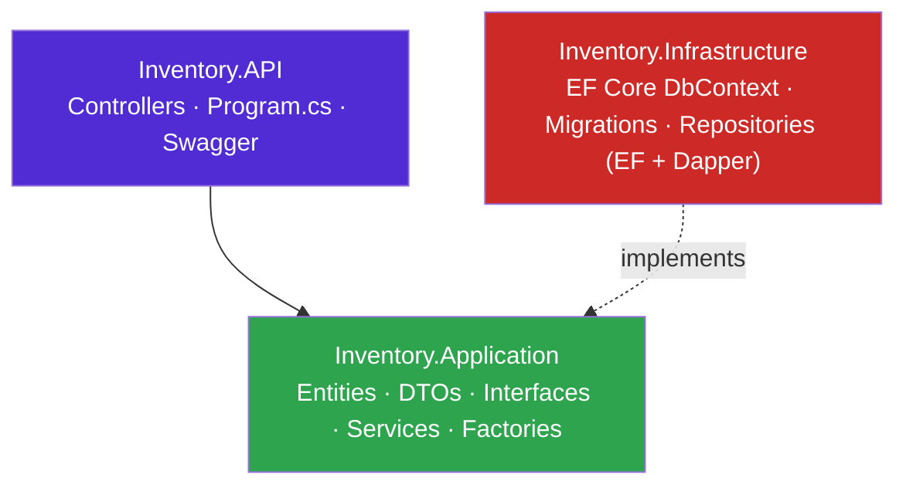

<div align="center">

# 📦 Inventory Management System

**A full-stack Inventory Management System** built as part of a .NET backend internship at **e-strats**.
Manages master data (Categories, Suppliers, Products) and transactional data (Purchases, Sales), with real-time stock updates and financial reporting.

[](https://dotnet.microsoft.com/)
[](https://react.dev/)
[](https://www.microsoft.com/sql-server)
[](https://learn.microsoft.com/ef/core/)
[](https://github.com/DapperLib/Dapper)
[]()

*Built to demonstrate enterprise-grade backend practices: Clean Architecture, the Repository Pattern, SOLID principles, EF Core + Dapper together, the Abstract Factory pattern, and Soft Delete via global query filters.*

</div>

---

## 📋 Table of Contents

- [Tech Stack](#-tech-stack)
- [Architecture](#-architecture)
- [Key Engineering Concepts](#-key-engineering-concepts-implemented)
- [Project Structure](#-project-structure)
- [Getting Started](#-getting-started)
- [API Endpoints](#-api-endpoints)
- [Database Migrations](#-database-migrations)
- [Development Journey](#-development-journey)
- [Roadmap](#-roadmap)

---

## 🛠 Tech Stack

| Layer | Technology |
|---|---|
| Frontend | React (Vite), Axios, custom dark-mode UI |
| Backend | ASP.NET Core Web API (.NET 10) |
| Database | SQL Server (LocalDB by default) |
| ORM (CRUD) | Entity Framework Core |
| ORM (Reporting) | Dapper (raw SQL for high-performance JOIN queries) |
| API Docs | Swagger / OpenAPI |

## 🏛 Architecture

Strict N-Tier / Clean Architecture, with dependencies flowing inward:



* **Controllers** stay thin — they only call into Services.
* **Services** hold business logic (e.g. stock validation on sale, updating `StockQuantity`).
* **Repositories** are the only layer that talks to the database, via a **Generic Repository** (`IRepository<T>` / `Repository<T>`) for common CRUD, plus specific repositories for domain rules.
* **Dependency Injection** wires every interface to its concrete implementation in `Program.cs`, including **keyed DI** for the reporting factories (see below).

## ✅ Key Engineering Concepts Implemented

- **SOLID** — Single Responsibility (Controllers vs. Services vs. Repositories are fully separated) and Open/Closed (soft delete was added via an EF Core global query filter without touching existing repository code).
- **Encapsulation** — `Product.StockQuantity` has a private setter; it can only change through `AddStock()` / `RemoveStock()` domain methods, not by direct assignment.
- **Abstraction** — every repository and service is consumed through an interface (`ICategoryRepository`, `IProductService`, etc.), enabling DI and testability.
- **Factory Method** — `IInvoiceFactory` creates Purchase/Sale/Return invoices based on `InvoiceType`, encapsulating tax and numbering rules per type.
- **Abstract Factory** — `IReportFactory` produces a *family* of related report documents (`IInventoryReportDocument`, `ISalesReportDocument`) for a given output format. `ExcelReportFactory` and `PdfReportFactory` are registered as **keyed singletons** (`ReportFormat.Excel` / `ReportFormat.Pdf`) and resolved at runtime by `ReportsController`, so adding a new format (e.g. CSV) requires no changes to the controller.
- **Soft Delete** — master data (Products, Categories, Suppliers) uses an `IsDeleted` flag instead of hard deletes, so historical Purchase/Sale records never lose their foreign-key targets. Enforced globally via:
  ```csharp
  modelBuilder.Entity<Product>().HasQueryFilter(e => !e.IsDeleted);
  ```
- **Transactional Integrity** — creating a Purchase increases `StockQuantity`; creating a Sale decreases it and is blocked if requested quantity exceeds stock on hand.

## 📂 Project Structure

```
Inventory-Management-System-WebApp/
├── InventoryManagementSystem/              # backend (.NET)
│   ├── InventoryManagementSystem.slnx
│   ├── Inventory.API/                      # Controllers, Program.cs, appsettings
│   ├── Inventory.Application/              # Entities, DTOs, Interfaces, Services, Factories, Reports
│   │   ├── Factories/                      # InvoiceFactory, ExcelReportFactory, PdfReportFactory
│   │   ├── Reports/Excel/                  # ExcelInventoryReport, ExcelSalesReport
│   │   └── Reports/Pdf/                    # PdfInventoryReport, PdfSalesReport
│   └── Inventory.Infrastructure/           # DbContext, Migrations, Repositories (EF + Dapper)
└── Inventory-Management-System-frontend/   # frontend (React + Vite)
    ├── index.html / vite.config.js / package.json
    ├── public/
    └── src/
        ├── components/                     # Category/Product/Supplier/Purchase/Sale/Reports UI
        ├── services/                       # Axios API clients (one per resource)
        ├── App.jsx / main.jsx
        └── assets/
```

## 🚀 Getting Started

### Prerequisites
- [.NET 10 SDK](https://dotnet.microsoft.com/download)
- SQL Server (LocalDB is fine for development)
- Node.js 18+ and npm
- (Optional) Visual Studio 2022+ or VS Code

### Backend Setup

```bash
cd InventoryManagementSystem
dotnet restore

# Update the connection string if you're not using LocalDB
# (Inventory.API/appsettings.json → ConnectionStrings:DefaultConnection)

cd Inventory.API
dotnet ef database update --project ../Inventory.Infrastructure
dotnet run
```

The API will start on `https://localhost:7207` (and `http://localhost:5233`), with Swagger UI at `/swagger` in Development mode.

### Frontend Setup

```bash
cd Inventory-Management-System-frontend
npm install
npm run dev
```

The frontend expects the API at `https://localhost:7207/api` (configured in `src/services/axiosConfig.js`) and is allowed by the backend's CORS policy, which currently permits `http://localhost:5173` (Vite's default port).

## 🔌 API Endpoints

All routes are prefixed with `/api`.

| Resource | Endpoints |
|---|---|
| Categories | `GET /categories`, `GET /categories/{id}`, `POST /categories`, `PUT /categories/{id}`, `DELETE /categories/{id}` |
| Products | `GET /products`, `GET /products/{id}`, `GET /products/category/{categoryId}`, `POST /products`, `PUT /products/{id}`, `DELETE /products/{id}` |
| Suppliers | `GET /suppliers`, `GET /suppliers/{id}`, `POST /suppliers`, `PUT /suppliers/{id}`, `DELETE /suppliers/{id}` |
| Purchases | `GET /purchases`, `GET /purchases/{id}`, `POST /purchases`, `PUT /purchases/{id}`, `DELETE /purchases/{id}` |
| Sales | `GET /sales`, `GET /sales/{id}`, `POST /sales`, `PUT /sales/{id}`, `DELETE /sales/{id}` |
| Reports | `GET /reports/inventory-valuation` — Dapper-powered stock valuation report (`StockQuantity × UnitPrice`, joined across Products/Categories/Suppliers) |
| Reports | `GET /reports/document?type={inventory\|sales}&format={excel\|pdf}` — **New:** Abstract Factory-driven document endpoint. Resolves the requested `IReportFactory` via keyed DI and generates the matching report document. Content generation is currently stubbed (returns a placeholder string per format/type) pending the real Excel/PDF export work in the roadmap. |

## 🗄 Database Migrations

| Migration | Purpose |
|---|---|
| `InitialCreate` | Base schema for Categories, Suppliers, Products, Purchases, Sales |
| `FixPurchaseDetailForeignKey` | Corrected FK relationship on `PurchaseDetail` |
| `MakePurchaseDetailsCascadeDelete` | Adjusted delete behavior for purchase line items |
| `AddSoftDeleteProperties` | Added `IsDeleted` to master data entities |

## 🧭 Development Journey

1. **Phase 1** — Backend foundation: Web API, Repository Pattern, Generic Repository, Service Layer, DI.
2. **Phase 2** — React frontend wired up to the API (CORS, ports, forms, tables, async state).
3. **Phase 3** — Purchases (stock in) and Sales (stock out), with live `StockQuantity` updates and over-sell validation.
4. **Phase 4** — High-performance reporting with Dapper (inventory valuation).
5. **Phase 5** — Soft delete for master data to protect historical financial records, via EF Core global query filters.
6. **Phase 6** — Abstract Factory reporting pipeline: `IReportFactory` family (Excel/PDF) producing `IInventoryReportDocument` and `ISalesReportDocument` products, resolved via keyed DI in `ReportsController`.

## 🗺 Roadmap

- [ ] Implement actual Excel/PDF export inside `ExcelInventoryReport` / `ExcelSalesReport` / `PdfInventoryReport` / `PdfSalesReport` (the Abstract Factory scaffolding is in place; `Generate()` still returns placeholder text)
- [ ] Add authentication/authorization
- [ ] Unit/integration test coverage

---

**Author:** Abdullah Saleem — .NET Backend Intern, e-strats
